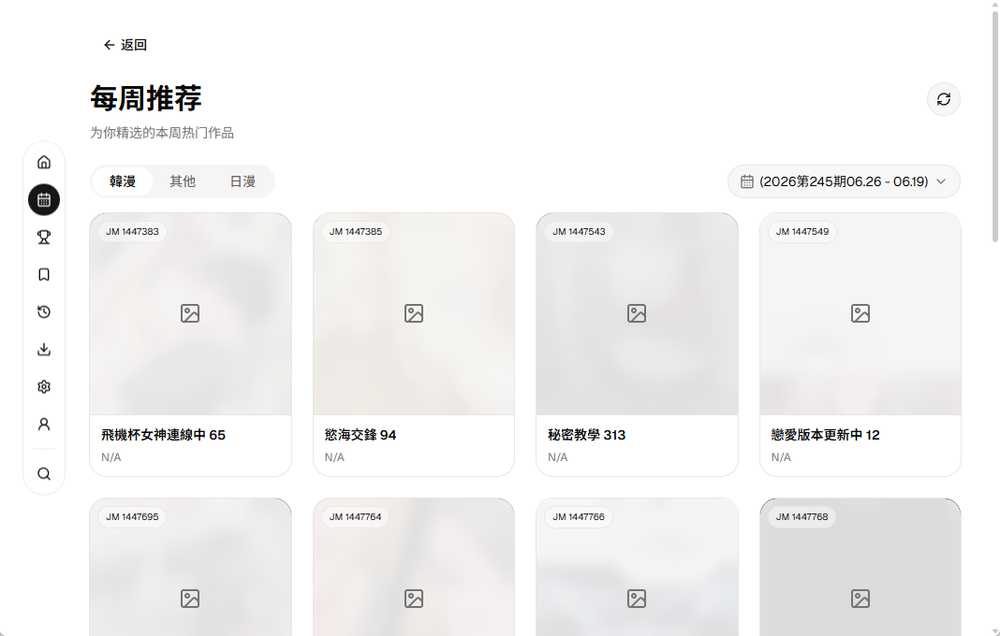

# JM Boom

跨平台禁漫天堂第三方客户端。

## WIP

当前项目处于高速开发中，功能和特性可能会发生巨大变化。

支持 `Windows`、`Linux`、`MacOS`。

> \[!IMPORTANT]
>
> `Linux` 和 `MacOS` 的构建未经过任何测试。

### MacOS 安装

出现 `应用已损坏` 或 `无法验证开发者`，请使用 `xattr -cr` 放行。

前往下载 [Release](https://github.com/ppxb/jm-boom/releases)。

## Screenshots





## 特性 TODO

### 已完成

- [x] 首页
- [x] 每周推荐
- [x] 详情页、章节列表、相关推荐和评论
- [x] 阅读器单页阅读（从左到右、从右到左）、竖屏阅读、键盘翻页、点击翻页
- [x] 阅读历史
- [x] 收藏列表
- [x] 个人中心、自动登录、自动签到
- [x] 设置
- [x] 详情页标签、作者搜索
- [x] 搜索页
- [x] 章节/批量章节下载
- [x] 自动阅读模式
- [x] 多平台打包与发布流程

### 进行中

- [ ] 阅读器体验进一步优化

### 规划中

- [ ] 更完善的离线缓存管理体验
- [ ] 细化桌面端交互和快捷键支持
- [ ] 桌面端系统托盘
- [ ] 本地漫画管理

### 预计不会实现的特性

在接入多个源的测试后，并没有带来更好的体验，反而造成了性能问题和额外的心智负担。其他源多是通过 `Html` 抓取而来，且字段不统一，项目因此变得臃肿、低效，于是放弃接入多漫画源。

## 启动项目

```bash
bun install
bun run tauri dev
```

## NSFW 警告

本软件可能存在裸露、暴力、色情或冒犯等不适宜公众场合的内容，请勿在公共场合使用本软件，避免不必要的纷争。

## 致谢

本项目参考了以下项目的部分实现，在此表示衷心的感谢！

- [jm-mobile](https://github.com/Dedicatus546/jm-mobile)
- [Breeze](https://github.com/deretame/Breeze)
- [jmcomic-next](https://github.com/HongShi2333/jmcomic-next)

同时感谢社区 [LinuxDO](https://linux.do) 的帮助。

## 免责声明

本项目仅供学习、研究和技术交流使用。项目作者与任何第三方服务、原始应用或内容提供方无关。
使用者应自行遵守当地法律法规以及相关服务条款。因使用本项目产生的任何法律、版权、账号、数据或财务风险均由使用者自行承担。

## License

遵循 [MIT](./LICENSE) 协议。

## Star History

<a href="https://www.star-history.com/?repos=ppxb%2Fjm-boom&type=date&legend=top-left">
 <picture>
   <source media="(prefers-color-scheme: dark)" srcset="https://api.star-history.com/chart?repos=ppxb/jm-boom&type=date&theme=dark&legend=top-left&sealed_token=xBdzI13ThPSrBmsH1hTwkJ4k3BeQH7GmAkzvOlPpvyQDS8IMlHCI00IiBHU4zpMhErHtg6nTgZdwthEO1yDLoenKZOo1owHT7pObsu8FOq_2KI80Aw1RoDW-3oaLeFdGzqs0F3DVRs-3fyEn92_Hi32SmjeVMoSF0IcSPo6z7VixmjZhG2B66b5GL_eI" />
   <source media="(prefers-color-scheme: light)" srcset="https://api.star-history.com/chart?repos=ppxb/jm-boom&type=date&legend=top-left&sealed_token=xBdzI13ThPSrBmsH1hTwkJ4k3BeQH7GmAkzvOlPpvyQDS8IMlHCI00IiBHU4zpMhErHtg6nTgZdwthEO1yDLoenKZOo1owHT7pObsu8FOq_2KI80Aw1RoDW-3oaLeFdGzqs0F3DVRs-3fyEn92_Hi32SmjeVMoSF0IcSPo6z7VixmjZhG2B66b5GL_eI" />
   
 </picture>
</a>
