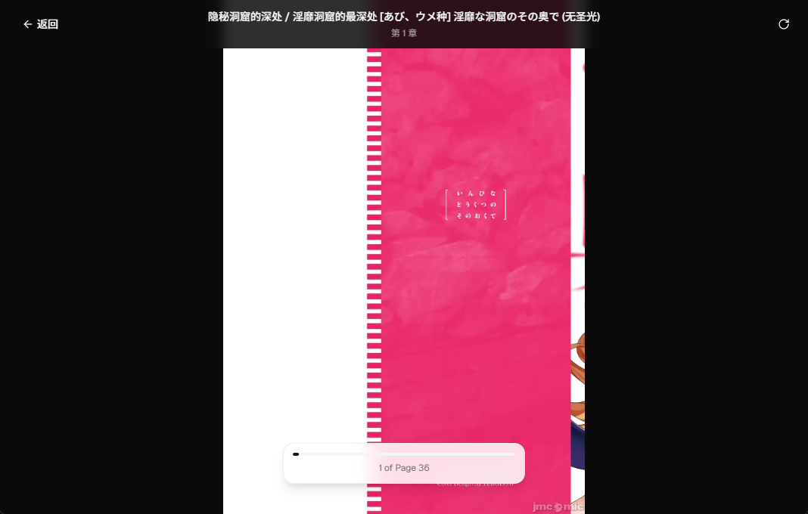
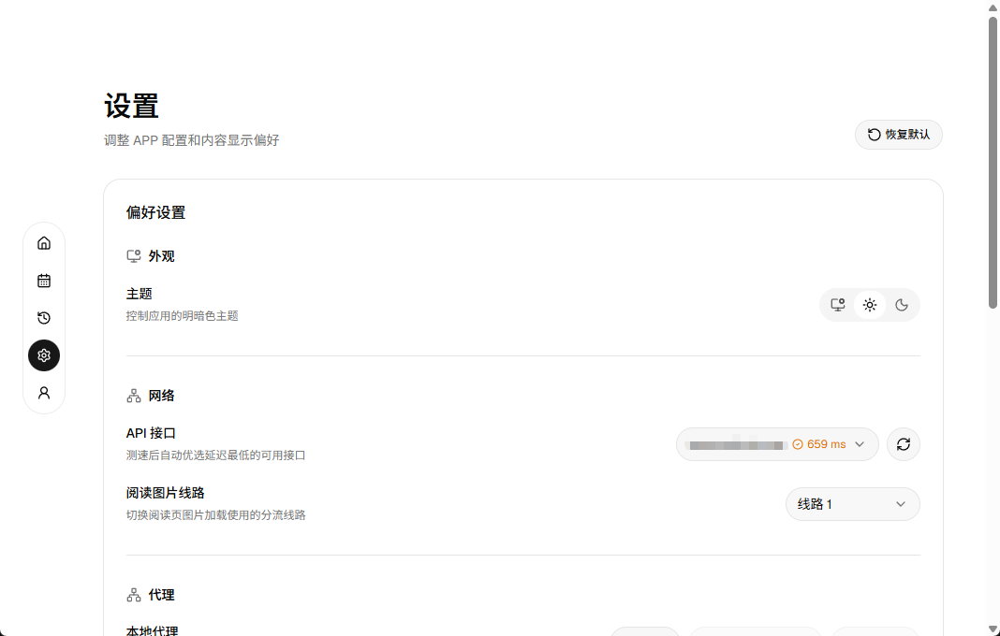

# JM Boom

禁漫天堂跨平台客户端。

## WIP

当前项目处于高速开发中，暂不提供制品，请下载源代码后自动编译。

## 截图








## 环境依赖

- Bun：用于安装前端依赖、运行 Vite 和 Tauri CLI
- Rust stable：用于编译 `src-tauri`

## 启动项目

```bash
bun install
bun run tauri dev
```

## NSFW 警告

本软件可能存在裸露、暴力、色情或冒犯等不适宜公众场合的内容，请勿在公共场合使用本软件，避免不必要的纷争。

## 致谢

本项目参考了以下项目的部分实现，在此表示衷心的感谢！

- [jm-mobile](https://github.com/Dedicatus546/jm-mobile)
- [Breeze](https://github.com/deretame/Breeze)
- [jmcomic-next](https://github.com/HongShi2333/jmcomic-next)

同时感谢社区 [LinuxDO](https://linux.do) 的帮助。

## 免责声明

本项目仅供学习、研究和技术交流使用。项目作者与任何第三方服务、原始应用或内容提供方无关。
使用者应自行遵守当地法律法规以及相关服务条款。因使用本项目产生的任何法律、版权、账号、数据或财务风险均由使用者自行承担。

## License

遵循 [MIT](./LICENSE) 协议。
