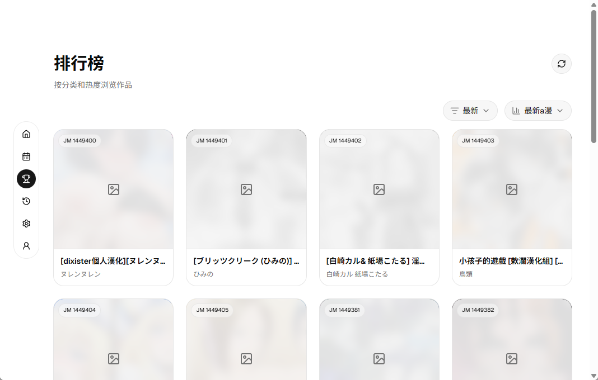

# JM Boom

禁漫天堂跨平台客户端。

## WIP

当前项目处于高速开发中，功能和特性可能会发生巨大变化。

测试版本已发布，暂时支持 `Windows`。

前往下载 [Release](https://github.com/ppxb/jm-boom/releases)。

## 截图





## 特性 TODO

### 已完成

- [x] 首页信息流与基础导航
- [x] 每周推荐页
- [x] 详情页、章节列表、相关推荐和评论
- [x] 阅读器单页阅读、键盘翻页、点击翻页和返回导航
- [x] 阅读历史记录与进度恢复
- [x] 收藏列表入口与收藏页
- [x] 个人中心、登录与签到
- [x] 设置页：API 探测、图片线路、代理、主题、封面隐私、预载数量、缓存管理
- [x] 阅读器缓存、预载和图片解扰优化
- [x] 详情页标签搜索
- [x] 搜索及相关页面

### 进行中
- [ ] 双页阅读模式
- [ ] 滚动阅读模式
- [ ] 阅读器排版进一步优化
- [ ] 更完整的多平台打包与发布流程
- [ ] 下载

### 规划中

- [ ] 更细的阅读器性能优化
- [ ] 更完善的离线缓存管理体验
- [ ] 细化桌面端交互和快捷键支持
- [ ] 桌面端系统托盘
- [ ] 本地漫画管理

## 环境依赖

- Bun：用于安装前端依赖、运行 Vite 和 Tauri CLI
- Rust stable：用于编译 `src-tauri`

## 启动项目

```bash
bun install
bun run tauri dev
```

## NSFW 警告

本软件可能存在裸露、暴力、色情或冒犯等不适宜公众场合的内容，请勿在公共场合使用本软件，避免不必要的纷争。

## 致谢

本项目参考了以下项目的部分实现，在此表示衷心的感谢！

- [jm-mobile](https://github.com/Dedicatus546/jm-mobile)
- [Breeze](https://github.com/deretame/Breeze)
- [jmcomic-next](https://github.com/HongShi2333/jmcomic-next)

同时感谢社区 [LinuxDO](https://linux.do) 的帮助。

## 免责声明

本项目仅供学习、研究和技术交流使用。项目作者与任何第三方服务、原始应用或内容提供方无关。
使用者应自行遵守当地法律法规以及相关服务条款。因使用本项目产生的任何法律、版权、账号、数据或财务风险均由使用者自行承担。

## License

遵循 [MIT](./LICENSE) 协议。

## Star History

<a href="https://www.star-history.com/?repos=ppxb%2Fjm-boom&type=date&legend=top-left">
 <picture>
   <source media="(prefers-color-scheme: dark)" srcset="https://api.star-history.com/chart?repos=ppxb/jm-boom&type=date&theme=dark&legend=top-left" />
   <source media="(prefers-color-scheme: light)" srcset="https://api.star-history.com/chart?repos=ppxb/jm-boom&type=date&legend=top-left" />
   
 </picture>
</a>
